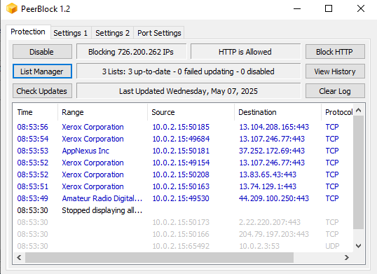
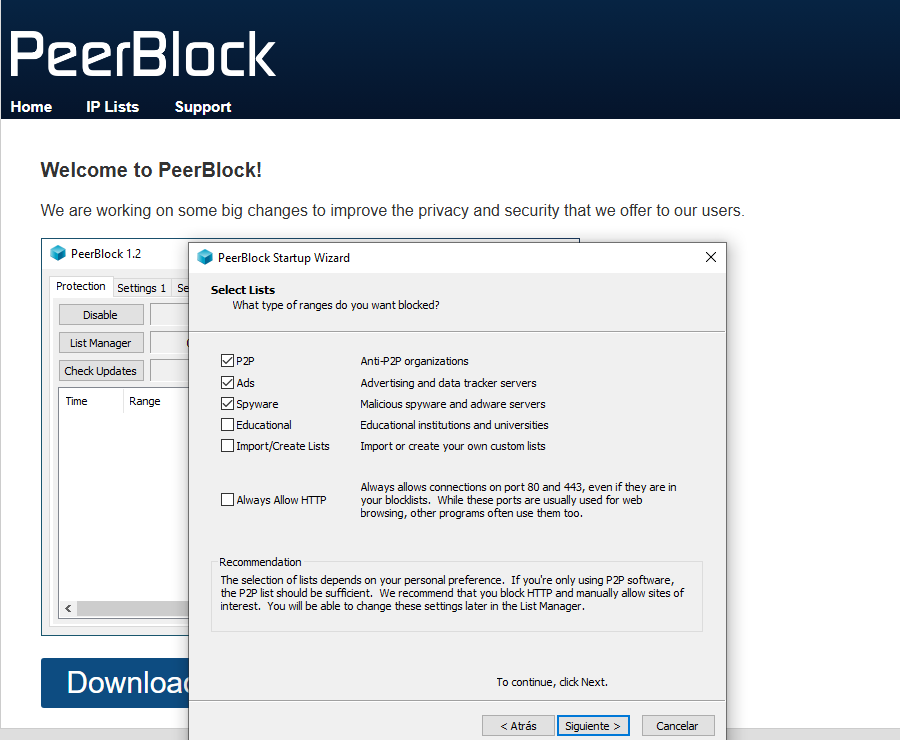

# **Documentació de l'Activitat - Mòdul 6: Firewalls i Scripts**  
**CFGM SMX - Seguretat Informàtica**  
**Nom:** Jan Vilaplana Bages  
**Data:** 07/05/2025

---

## **📌 Part 1: Configuració de PeerBlock (Firewall en Windows 10)**

### **🔧 Instal·lació**
1. Descarrega PeerBlock des del lloc oficial: [https://www.peerblock.com](https://www.peerblock.com)
2. Executa l'instal·lador (desmarca opcions de programari addicional)

### **⚙️ Configuració Bàsica**
```plaintext
Llistes activades:
- P2P (bloqueja xarxes d'intercanvi d'arxius)
- Ads (bloqueja servidors de publicitat)
- Spyware (bloqueja IPs malicioses)
```
### **🔒 Regles Específiques per XAMPP/WAMP**
```powershell
Ports permesos:
• 80/TCP (HTTP)
• 443/TCP (HTTPS)

Ports bloquejats:
• Totes les connexions entrants no autoritzades
```
### **📸 Captures Obligatòries**
<<<<<<< HEAD


=======

>>>>>>> 12e283da52f17b1c2a54701f7aca403b3a2e0570

## **💻 Part 2: Script de Monitorització en PowerShell**
### **📜 Codi Complet**
```powershell
# Script: network_monitor.ps1
# Descripció: Registra estat de la xarxa

$logDir = "C:\log_[nom]"
$userAdmin = "admin_[nom]"

# Crear carpeta segura
if (-not (Test-Path $logDir)) {
    New-Item -ItemType Directory -Path $logDir
    icacls $logDir /grant:r "$userAdmin`:(OI)(CI)F" /remove "Tots"
}

# Generar informe
$report = @"
=== INFORMACIÓ DE XARXA ===
$(ipconfig /all)

=== TAULA D'ENCAMINAMENT ===
$(route print)

=== CONNEXIONS ACTIVES ===
$(netstat -ano)
"@

$report | Out-File "$logDir\network_$(Get-Date -Format 'yyyyMMdd_HHmmss').txt"
```
### **⚡ Configurar Alias (Tecla X)**
#### 1. Crear fitxer X.bat:
```batch
@echo off
powershell -ExecutionPolicy Bypass -File "C:\scripts\network_monitor.ps1"
```
#### 2.Afegir al PATH o crear acces directe
### **🔐 Permisos**
```cmd
:: Assegurar permisos restringits
icacls "C:\log_[nom]" /grant:r "admin_[nom]`:(OI)(CI)F" /remove "Tots"
```


