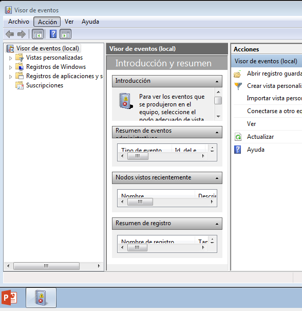
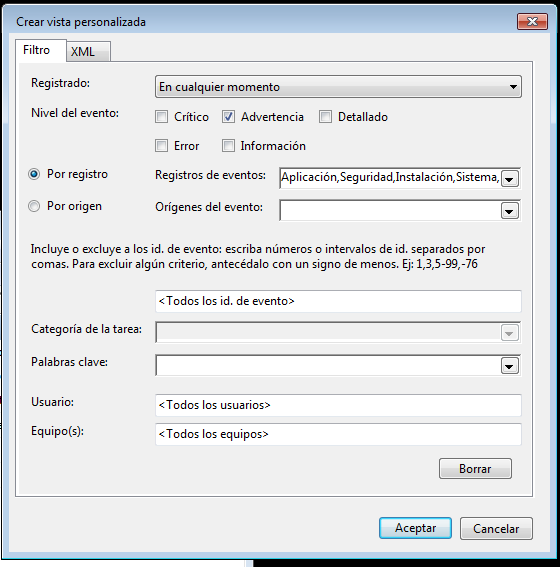
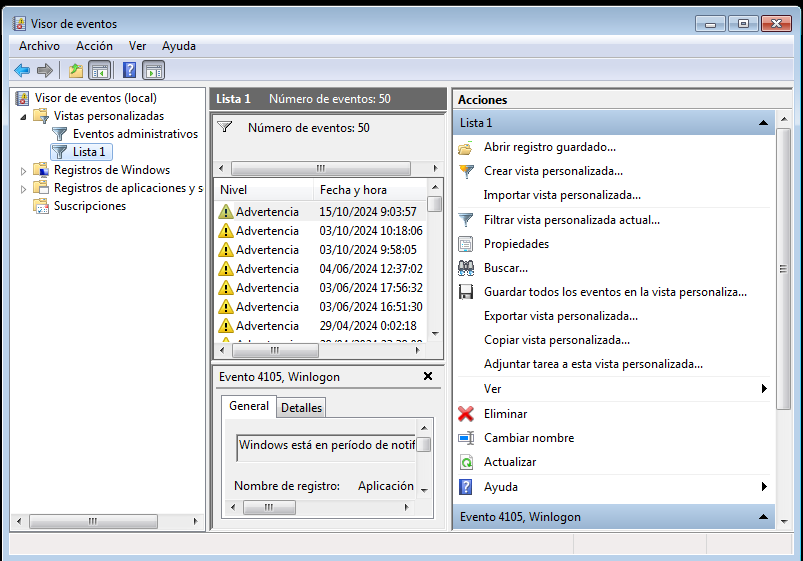
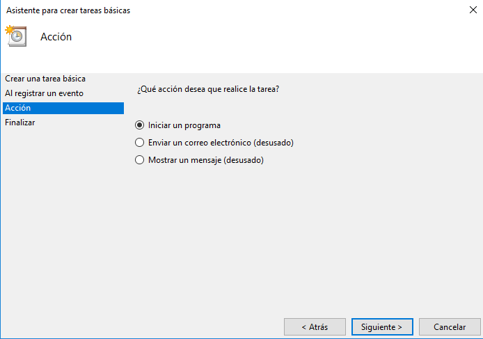
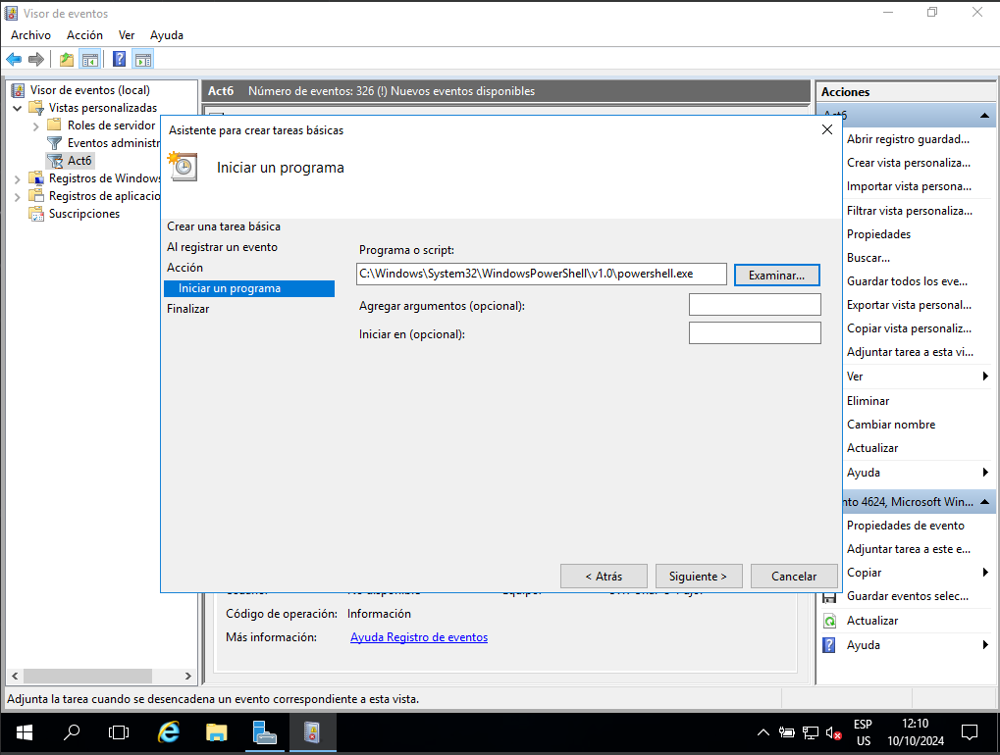
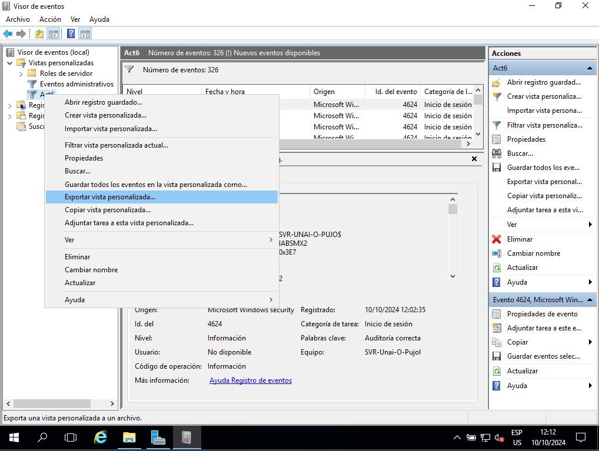
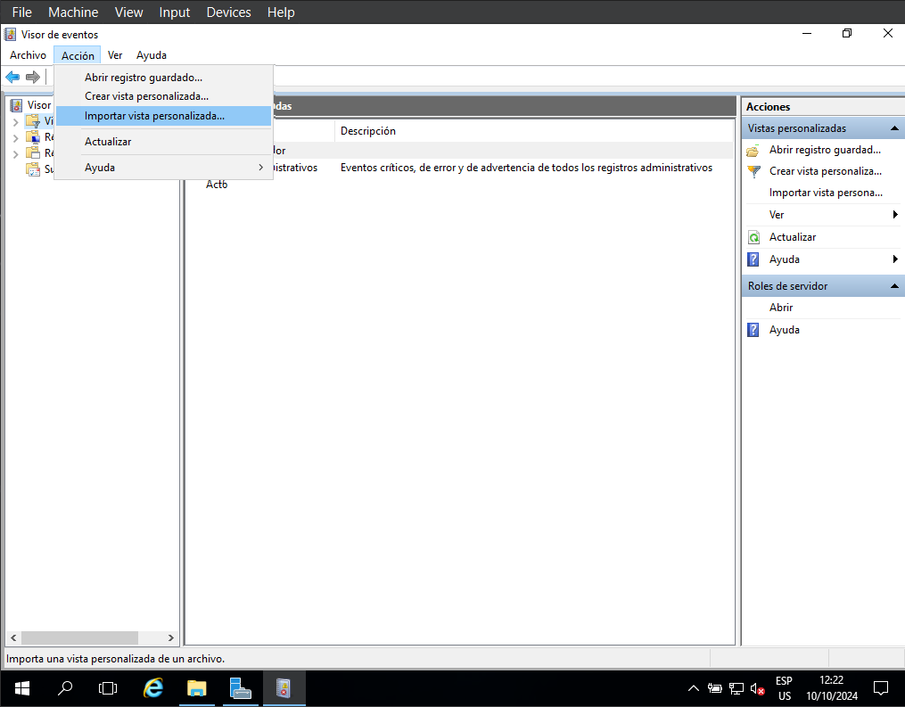

# Activitat 6 - Visor d'Esdeveniments

## Documentació: Llista de ID d'esdeveniments de Windows Server

### Enunciat
Heu d'entregar una web accessible online explicant amb text i captures com feu el següent:

### 1. Crear una vista personalitzada
Per crear una vista personalitzada d'un esdeveniment al Visor d'Esdeveniments, seguiu aquests passos:

#### Obrim la nostra maquina virtual i busquem al buscador de Windows "Visor de eventos"

#### Obrim la pestaña de "Acció" i seleccionem "crear llista personalitzada", una vegada creada seleccionam el nivell de perill de l'event i en quin rang d'hores a aparegut.

#### Una vegada indicat el event , li donarem un nom a la nostra llista i sotiran tots els errors i una barra per a buscar, etc...

### 2. Crear una tasca
Per crear una tasca que s'executi quan un usuari iniciï sessió, seguiu aquests passos:
#### Primer feu clic a «Adjunta un fitxer a aquesta vista», després a «següent», després a «una altra vegada».

#### Aquí triem l'acció que realitzarà Windows després d'un 4624, en aquest cas triaré l'opció "Inicia un programa". Vull obrir Powershell.

`C:\\Windows\System32\WindowsPowerShell\v1.0\powershell.exe`
### 3. Exportar una vista personalitzada a un fitxer XML
Per exportar la vista personalitzada que heu creat, seguiu aquests passos:
#### Feu clic dret a Act6 i, a continuació, feu clic a "Exporta una vista personalitzada", nomeu el fitxer i deseu-lo on vulgueu.

```
<ViewerConfig>
  <QueryConfig>
    <QueryParams>
      <Simple>
        <Channel>Security</Channel>
        <EventId>4624</EventId>
        <RelativeTimeInfo>0</RelativeTimeInfo>
        <BySource>False</BySource>
      </Simple>
    </QueryParams>
    <QueryNode>
      <Name LanguageNeutralValue="Act6">Act6</Name>
      <QueryList>
        <Query Id="0" Path="Security">
          <Select Path="Security">*[System[(EventID=4624)]]</Select>
        </Query>
      </QueryList>
    </QueryNode>
  </QueryConfig>
  <ResultsConfig>
    <Columns>
      <Column Name="Nivel" Type="System.String" Path="Event/System/Level" Visible="">134</Column>
      <Column Name="Palabras clave" Type="System.String" Path="Event/System/Keywords">70</Column>
      <Column Name="Fecha y hora" Type="System.DateTime" Path="Event/System/TimeCreated/@SystemTime" Visible="">184</Column>
      <Column Name="Origen" Type="System.String" Path="Event/System/Provider/@Name" Visible="">94</Column>
      <Column Name="Id. del evento" Type="System.UInt32" Path="Event/System/EventID" Visible="">94</Column>
      <Column Name="Categoría de la tarea" Type="System.String" Path="Event/System/Task" Visible="">94</Column>
      <Column Name="Usuario" Type="System.String" Path="Event/System/Security/@UserID">50</Column>
      <Column Name="Código operativo" Type="System.String" Path="Event/System/Opcode">110</Column>
      <Column Name="Registro" Type="System.String" Path="Event/System/Channel">80</Column>
      <Column Name="Equipo" Type="System.String" Path="Event/System/Computer">170</Column>
      <Column Name="Id. de proceso" Type="System.UInt32" Path="Event/System/Execution/@ProcessID">70</Column>
      <Column Name="Id. de subproceso" Type="System.UInt32" Path="Event/System/Execution/@ThreadID">70</Column>
      <Column Name="Id. de procesador" Type="System.UInt32" Path="Event/System/Execution/@ProcessorID">90</Column>
      <Column Name="Id. de sesión" Type="System.UInt32" Path="Event/System/Execution/@SessionID">70</Column>
      <Column Name="Tiempo de kernel" Type="System.UInt32" Path="Event/System/Execution/@KernelTime">80</Column>
      <Column Name="Tiempo de usuario" Type="System.UInt32" Path="Event/System/Execution/@UserTime">70</Column>
      <Column Name="Tiempo de procesador" Type="System.UInt32" Path="Event/System/Execution/@ProcessorTime">100</Column>
      <Column Name="Id. de correlación" Type="System.Guid" Path="Event/System/Correlation/@ActivityID">85</Column>
      <Column Name="Id. de correlación relativa" Type="System.Guid" Path="Event/System/Correlation/@RelatedActivityID">140</Column>
      <Column Name="Nombre de origen de evento" Type="System.String" Path="Event/System/Provider/@EventSourceName">140</Column>
    </Columns>
  </ResultsConfig>
</ViewerConfig>

```

### 4. Importar la vista personalitzada des d'una altra màquina virtual (MV)
Per importar la vista personalitzada en una altra màquina, seguiu aquests passos:
#### Ara només heu de triar el fitxer XML.

